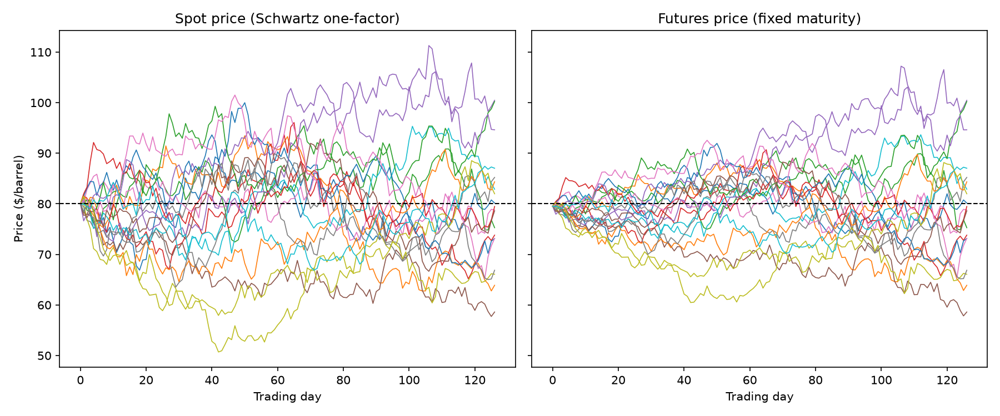
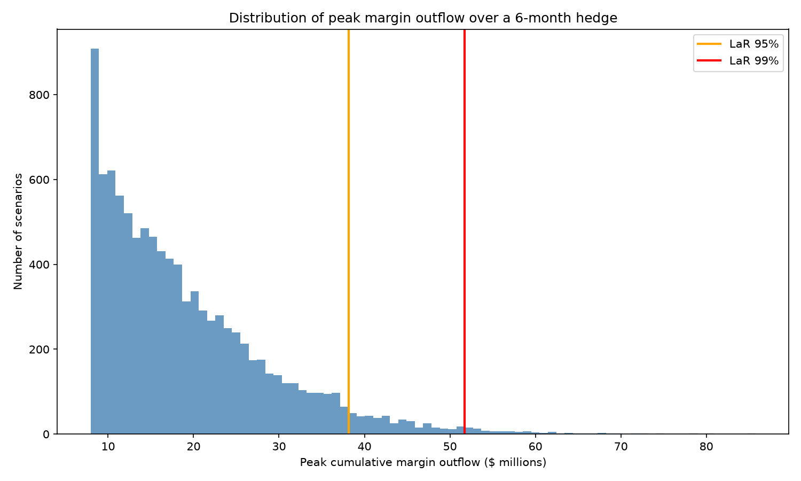
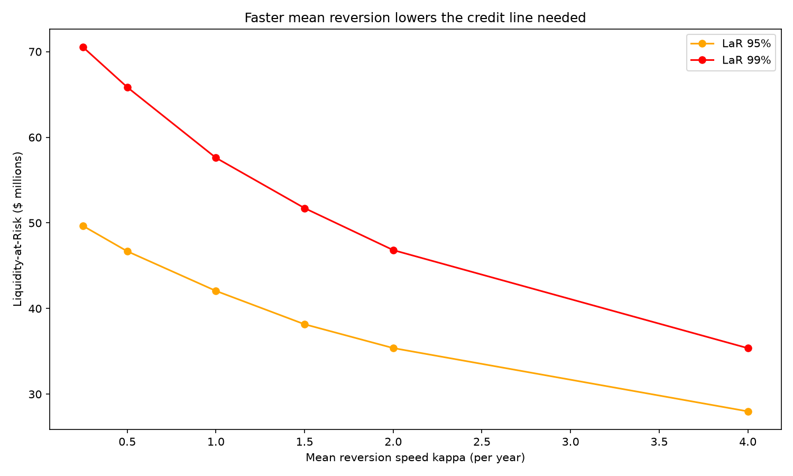

# Project 1: Margin Call Liquidity Risk Simulator

## The business problem

A commodity trader owns 1,000,000 barrels of physical oil and sells
1,000 futures contracts against it. In **value** terms the position is
perfectly hedged: if prices rise, the futures leg loses exactly what the
physical inventory gains.

In **cash** terms it is not hedged at all. Futures are marked to market
daily — every day the price rises, the exchange demands cash (variation
margin) on the short futures position immediately. The offsetting gain
on the physical barrels is only realised when they are eventually sold.
A sharp rally therefore drains cash even though the trader has lost
nothing economically.

This is not a theoretical risk. In 2022, European energy companies with
exactly this position (long physical power/gas, short futures hedges)
faced margin calls in the billions when prices spiked, and several
needed state-backed credit lines to avoid unwinding sound hedges at the
worst possible moment.

The question this project answers: **how large a committed credit line
is needed to meet every margin call over a 6-month hedge, at 95% and
99% confidence?** That number is called **Liquidity-at-Risk (LaR)** —
the analogue of Value-at-Risk, applied to cumulative cash outflows
instead of portfolio value.

## The model

### Spot price: Schwartz (1997) one-factor mean reversion

Commodity prices mean-revert: high prices attract supply and destroy
demand, and vice versa. The Schwartz one-factor model captures this by
making the log price X = ln(S) an Ornstein–Uhlenbeck process:

```
dX = kappa * (alpha - X) dt + sigma dW,   alpha = mu - sigma^2 / (2*kappa)
```

- `kappa` is the speed of mean reversion,
- `alpha` is the level the log price reverts to (`mu` minus a convexity
  adjustment, because the price is the exponential of X),
- `sigma` is the volatility of the log price.

The simulation uses the **exact discretisation** of the OU process, not
an Euler approximation, so it is correct for any step size:

```
X_next = X * exp(-kappa*dt) + alpha * (1 - exp(-kappa*dt))
         + sigma * sqrt((1 - exp(-2*kappa*dt)) / (2*kappa)) * Z
```

Plain geometric Brownian motion (GBM) is simulated as a baseline with
the same volatility but no mean reversion, to isolate how much mean
reversion matters for liquidity risk.

### Futures price

The hedge uses a contract with a fixed maturity date, so its
time-to-maturity T shrinks every day. Under the Schwartz model the
futures price has a closed form:

```
F(S, T) = exp( exp(-kappa*T) * ln(S) + (1 - exp(-kappa*T)) * alpha
               + (sigma^2 / (4*kappa)) * (1 - exp(-2*kappa*T)) )
```

The futures price is a blend of today's log spot price and the long-run
mean: the further away maturity is, the more mean reversion is expected
to act before settlement, so the less weight spot gets. This is why
long-dated futures are less volatile than spot (the Samuelson effect) —
and it is one of the two channels through which mean reversion reduces
margin risk.

### Margin mechanics

For a short position of N contracts of size Q:

- daily variation margin = `-N * (F_t − F_{t−1}) * Q`
  (a short futures position loses cash when the price rises),
- the cumulative margin balance is the running sum of those flows,
- the **peak outflow** on a path is the initial margin plus the deepest
  trough of the cumulative balance — the worst funding need at any point
  during the hedge, which is what a credit line must cover,
- initial margin is a flat 10% of notional, a simple proxy for the
  exchange's SPAN-style calculation.

LaR at 95%/99% is the corresponding percentile of peak outflow across
10,000 simulated paths.

## Parameters

All parameters are **illustrative**, chosen to be in a realistic range
for crude oil; none are calibrated to market data (see Limitations).

| Parameter | Value | Rationale |
|-----------|-------|-----------|
| Spot price | $80/bbl | Round number in the post-2021 WTI trading range |
| Long-run level `mu` | ln(80) | Start at the long-run level, so results isolate volatility rather than drift |
| Mean reversion `kappa` | 1.5 /yr | Deviations halve in ln(2)/1.5 ≈ 5.5 months, consistent with published oil estimates (order 0.5–2) |
| Volatility `sigma` | 35% | Typical annualised oil volatility outside crisis periods |
| GBM drift | 0 | Zero drift so GBM differs from Schwartz only by lack of reversion |
| Position | short 1,000 contracts × 1,000 bbl | $80m notional, NYMEX WTI contract size |
| Initial margin rate | 10% of notional | Simple proxy for exchange margin |
| Hedge horizon | 126 trading days (6 months) | Typical inventory hedge tenor |
| Futures maturity | 0.5 years | Contract matures when the hedge ends |
| Simulations | 10,000, seed 42 | Reproducible; percentile error at 99% is small at this sample size |

## Results

Reproduce with `python run_analysis.py` (all numbers below are from
seed 42).

### Headline numbers (Schwartz model)

| Statistic | Value |
|-----------|-------|
| Mean peak outflow | $19.1m |
| **LaR 95%** | **$38.2m** |
| **LaR 99%** | **$51.7m** |

On an $80m notional position that is economically hedged, the trader
still needs a committed credit line of roughly **$52m — about 65% of
notional — to survive margin calls at 99% confidence**. The initial
margin alone is $8m; the rest is variation margin risk.

### Simulated paths



The futures paths (right) are visibly smoother than spot early in the
horizon and converge to spot as maturity approaches — the Samuelson
effect produced by the `exp(-kappa*T)` weight in the futures formula.

### Distribution of peak margin outflow



The distribution is heavily right-skewed: most scenarios need modest
funding, but the tail scenarios — sustained rallies — are exactly the
ones that break traders, which is why the credit line must be sized at
a high percentile rather than at the mean.

### Schwartz vs GBM: mean reversion reduces liquidity risk

| Model | Mean peak outflow | LaR 95% | LaR 99% |
|-------|------------------:|--------:|--------:|
| Schwartz (mean-reverting) | $19.1m | $38.2m | $51.7m |
| GBM (no mean reversion) | $23.9m | $52.8m | $75.3m |

Ignoring mean reversion would oversize the credit line by ~45% at the
99% level. Mean reversion reduces LaR through two channels:

1. **Bounded excursions in spot.** Under GBM a price shock is permanent
   and shocks accumulate, so 6-month rallies can run far. Under
   Schwartz, every rally fights the pull back to the long-run level, so
   sustained extreme rallies — the scenarios that produce the deepest
   cumulative margin troughs — are much rarer.
2. **Dampened futures volatility.** The futures price weights spot by
   `exp(-kappa*T)`. Early in the hedge, when T is largest, a $1 spot
   move only moves the futures ~$0.47 (at kappa=1.5, T=0.5), so daily
   margin calls are smaller exactly when the remaining horizon — and
   hence the scope for further calls — is longest.

### Sensitivity to the mean reversion speed



| kappa (/yr) | LaR 95% | LaR 99% |
|------------:|--------:|--------:|
| 0.25 | $49.7m | $70.5m |
| 0.50 | $46.7m | $65.9m |
| 1.00 | $42.1m | $57.6m |
| 1.50 | $38.2m | $51.7m |
| 2.00 | $35.4m | $46.8m |
| 4.00 | $28.0m | $35.4m |

LaR falls monotonically as reversion speeds up, and as kappa → 0 the
numbers approach the GBM case. The practical warning: the credit line
size depends heavily on an estimated parameter. A desk that calibrates
kappa on calm data and then hits a regime where reversion breaks down
(2022 again) will find its credit line badly undersized — an argument
for stressing kappa downwards when sizing the facility.

## Running it

```bash
pip install -r ../requirements.txt
pytest            # 5 property-based tests
python run_analysis.py
```

## Tests

`tests/test_project1.py` checks properties that must hold by
construction, so failures indicate real bugs rather than noise:

1. Zero volatility (with spot at the long-run level) produces zero
   margin calls.
2. The simulated long-run mean of the log price converges to alpha.
3. The futures price converges to spot as time-to-maturity goes to zero.
4. Daily variation margins sum (telescope) to the total change in
   position value.
5. The same seed reproduces results exactly; a different seed does not.

## Limitations

- **Constant volatility.** Real commodity volatility spikes exactly when
  prices spike (as in 2022), so this model understates tail margin
  calls. A stochastic- or price-dependent-volatility extension would
  push LaR up.
- **No basis risk.** The physical inventory is assumed to track the
  futures underlying perfectly. Real physical–futures basis (location,
  grade, timing) means the "perfect value hedge" premise is itself
  optimistic.
- **Single factor.** One shock drives the whole curve, so parallel moves
  only. A second factor (Schwartz–Smith long-term/short-term) would
  allow the front and back of the curve to decouple.
- **No convenience yield dynamics.** Convenience yield is implicitly
  constant inside the futures formula; in reality it is stochastic and
  correlated with price, which changes futures volatility.
- **Illustrative parameters.** kappa, sigma, and the margin rate are
  plausible but not calibrated to market data. The kappa sensitivity
  section shows how much this matters.
- **Simplified margining.** A flat 10% initial margin ignores the fact
  that exchanges *raise* margin rates in volatile markets — another
  procyclical cash drain the model omits.
