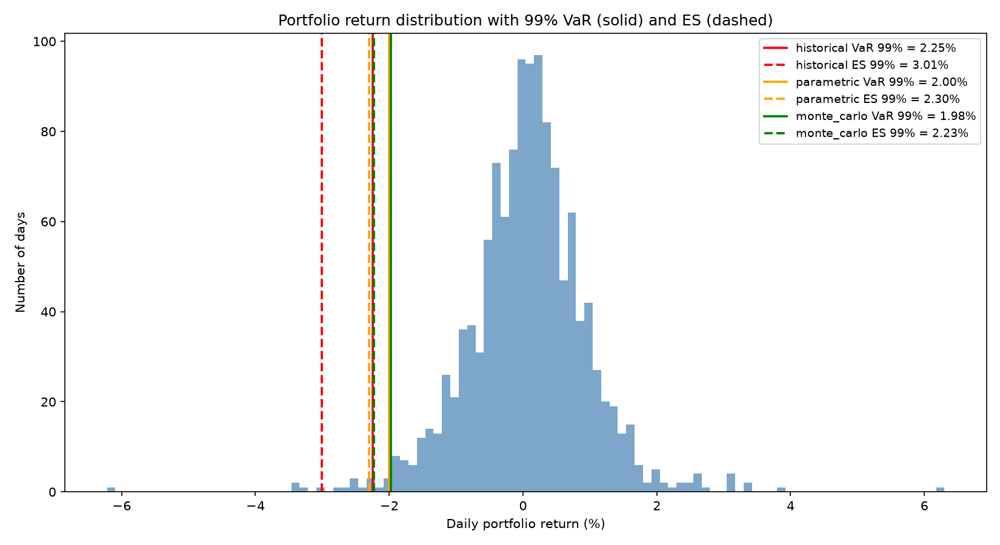
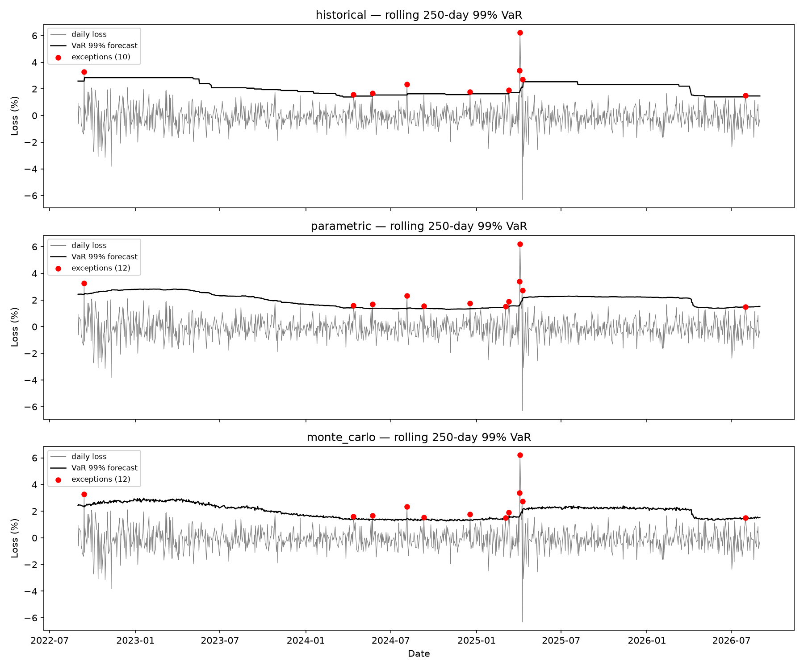

# Project 2: VaR and Expected Shortfall Engine with Backtesting

## The point of this project

Calculating VaR is easy — it is one quantile. What separates a risk
*calculator* from a validated risk *model* is backtesting: forecasting
VaR out of sample, day after day, and then testing statistically whether
the model delivered the coverage it promised. That validation loop —
rolling forecasts, exception counting, Kupiec and Christoffersen tests,
Basel traffic light zones — is the heart of this project.

## Definitions and why ES replaced VaR

With losses written as positive numbers, at confidence level c:

- **VaR(c)** is the loss exceeded on only (1−c) of days: "we won't lose
  more than X, 99 days out of 100."
- **ES(c)** is the *average* loss on the days VaR is exceeded: "and on
  the 1 bad day in 100, we expect to lose Y."

Under the Fundamental Review of the Trading Book (FRTB), regulatory
market risk capital moved from 99% VaR to 97.5% ES, for two reasons:

1. **Tail sensitivity.** VaR marks where the tail *starts* and is blind
   to what happens beyond it: two books with identical 99% VaR can have
   wildly different catastrophe exposure. ES averages over the whole
   tail, so fattening the tail beyond the quantile shows up immediately.
2. **Subadditivity.** A coherent risk measure should never say that a
   merged portfolio is riskier than the sum of its parts —
   diversification cannot create risk. ES always satisfies this
   (ES(A+B) ≤ ES(A) + ES(B)); VaR can violate it for non-elliptical
   distributions (e.g. portfolios of deep out-of-the-money short
   options), meaning VaR can *penalise* diversification.

The classic caveat cuts the other way: ES is harder to backtest than
VaR, because an exception count is directly observable while an average
tail loss is not (this is the "elicitability" debate). This project
therefore backtests the VaR quantiles, as regulators still do under
FRTB's P&L attribution and backtesting framework.

## The three methods

| Method | How it works | Strengths | Weaknesses |
|--------|--------------|-----------|------------|
| Historical simulation | Empirical quantile of the last 250 daily losses | No distributional assumption; captures fat tails that actually occurred | Blind beyond the worst observed day; VaR jumps when a crash enters/leaves the window ("ghost effects"); needs lots of data at 99% |
| Parametric (variance–covariance) | Fit a normal distribution, read the quantile analytically | Fast, smooth, transparent; ES has a closed form | Equity returns are fat-tailed, so a normal fit understates 99% VaR precisely in the tail you care about |
| Monte Carlo | Draw correlated asset returns from a fitted multivariate normal, aggregate with weights, take the empirical quantile | Preserves cross-asset correlations; the normal driver can be swapped for fat-tailed or scenario drivers without touching the pipeline | With a normal driver it converges to the parametric answer, at 5,000× the cost — its value is the extensible architecture, not this particular number |

A square-root-of-time scaler is included for multi-day horizons, with
its health warning: `VaR_h = VaR_1d * sqrt(h)` is only exact for iid
returns. Real returns exhibit volatility clustering, so after a loss,
further large losses are more likely than iid implies — sqrt-of-time
understates multi-day risk exactly when it matters.

## Data and setup

- Portfolio: equal-weighted AAPL, JPM, XOM, PG, JNJ (five sectors, so
  the covariance matrix is non-trivial), rebalanced daily.
- Sample: 2021-09-02 to 2026-08-31 (1,253 trading days), daily adjusted
  closes from Yahoo Finance via `yfinance`.
- **Reproducibility:** the download is cached to `data/prices.csv` and
  that CSV is committed, so the repo runs with no network access. The
  Monte Carlo seed is fixed (42, offset per backtest day).
- Rolling backtest: 250-day estimation window, tested on the next day,
  rolled forward — 1,003 out-of-sample test days per method.

## Results

Reproduce with `python run_analysis.py`.

### The return distribution and the fat-tail problem



Full-sample 99% estimates: historical VaR 2.25% / ES 3.01%, parametric
VaR 2.00% / ES 2.30%, Monte Carlo VaR 1.98% / ES 2.23%. Two things to
notice:

- Historical VaR sits ~25bp above the normal-based methods — the
  empirical tail is fatter than a normal fit admits — and the gap widens
  for ES (3.01% vs 2.30%) because ES looks *into* the tail.
- The worst observed day was −6.4%, nearly three parametric ES's. A
  normal distribution fitted to this data considers that day
  essentially impossible; it happened.

### Backtest: losses vs rolling VaR forecasts



The historical VaR line moves in steps (it jumps only when an extreme
day enters or leaves the 250-day window — the "ghost effect"), the
parametric line is smooth, and the Monte Carlo line is the parametric
line plus simulation noise. Note the burst of exceptions in early 2025:
all three models were too slow to raise VaR while volatility spiked.

### Formal test results (1,003 out-of-sample days)

| Method | Conf. | Expected exc. | Actual exc. | Kupiec p | Christoffersen p | Basel zone (last 250d) |
|--------|------:|--------------:|------------:|---------:|-----------------:|:----------------------:|
| historical | 95% | 50.2 | 48 | 0.75 | 0.10 | n/a |
| historical | 99% | 10.0 | 10 | 0.99 | 0.08 | green |
| parametric | 95% | 50.2 | 45 | 0.45 | 0.06 | n/a |
| parametric | 99% | 10.0 | 12 | 0.54 | 0.13 | green |
| monte_carlo | 95% | 50.2 | 45 | 0.45 | 0.06 | n/a |
| monte_carlo | 99% | 10.0 | 12 | 0.54 | 0.13 | green |

### Interpretation: which method performs best, and why

- **All three methods pass Kupiec** (exception counts are consistent
  with the promised coverage) and all sit in the **Basel green zone**
  over the last 250 days. On unconditional coverage alone, none can be
  rejected on this sample.
- **Historical simulation is the best calibrated here**: 10 exceptions
  against 10.0 expected at 99% (Kupiec p = 0.99). It wins for the
  expected reason — it does not impose normality, so its 99% quantile
  sits where the fat-tailed data actually puts it. The parametric and
  Monte Carlo methods, sharing the normal assumption, both come in
  slightly thin (12 exceptions) — mild but in the predicted direction.
- **Monte Carlo matches parametric almost exactly** (identical exception
  counts). That is the correct outcome, not a coincidence: with a
  multivariate normal driver, MC is just a noisy estimate of the
  parametric quantile. The comparison is included precisely to make
  that point — an MC engine adds value only when its driver adds
  something (fat tails, nonlinear positions, stress scenarios).
- **The caveat is in the Christoffersen column.** Every p-value is
  between 0.06 and 0.13 — none formally rejects at 5%, but all are
  uncomfortably low, and the exception plot shows why: a cluster of
  exceptions in the early-2025 volatility spike. All three models share
  the same weakness — a 250-day window reacts far too slowly when
  volatility regime-shifts, so exceptions arrive in bursts. Fixing this
  requires conditional volatility modelling (GARCH or EWMA weighting),
  not a better unconditional quantile.

## Running it

```bash
pip install -r ../requirements.txt
pytest            # 5 tests
python run_analysis.py
```

## Tests

`tests/test_project2.py`:

1. Parametric VaR and ES on genuinely normal data match the analytical
   formulas.
2. ES ≥ VaR for every method at every confidence level (it is a tail
   average beyond the quantile).
3. Historical VaR at 99.9% on 200 observations behaves sensibly at the
   sample boundary (bounded by the worst observed loss).
4. The Kupiec test decisively rejects a deliberately miscalibrated
   model (VaR far too low → ~30% exception rate → p < 0.001), while a
   correctly sized exception count is not rejected.
5. Monte Carlo with a fixed seed is exactly reproducible, and a
   different seed gives a different answer.

## Limitations

- **Normality in the parametric and MC methods.** Daily equity returns
  are fat-tailed and skewed; a normal fit understates 99% VaR and,
  worse, ES. A Student-t or Cornish-Fisher variant is the standard fix.
- **Historical simulation assumes the past represents the future.** A
  250-day window that contains no crisis forecasts none; the method
  cannot produce a loss worse than its window has seen.
- **No volatility clustering model.** All three methods treat the
  estimation window as one unconditional sample. The borderline
  Christoffersen results show the cost: exceptions cluster in volatility
  spikes. A GARCH(1,1) or EWMA (RiskMetrics) filter would let VaR rise
  within days of a regime change instead of within months.
- **No liquidity adjustment.** VaR here assumes positions can be exited
  at mid-market in one day. Concentrated or less liquid positions need
  a liquidity horizon adjustment (as FRTB in fact imposes).
- **Fixed equal weights, daily rebalancing.** Real portfolios drift and
  rebalance discretely; weight dynamics add risk not captured here.
- **One sample period.** 2021–2026 for five US large caps includes one
  bear market and one volatility spike; conclusions about method
  ranking should be re-tested across other regimes and asset classes.
