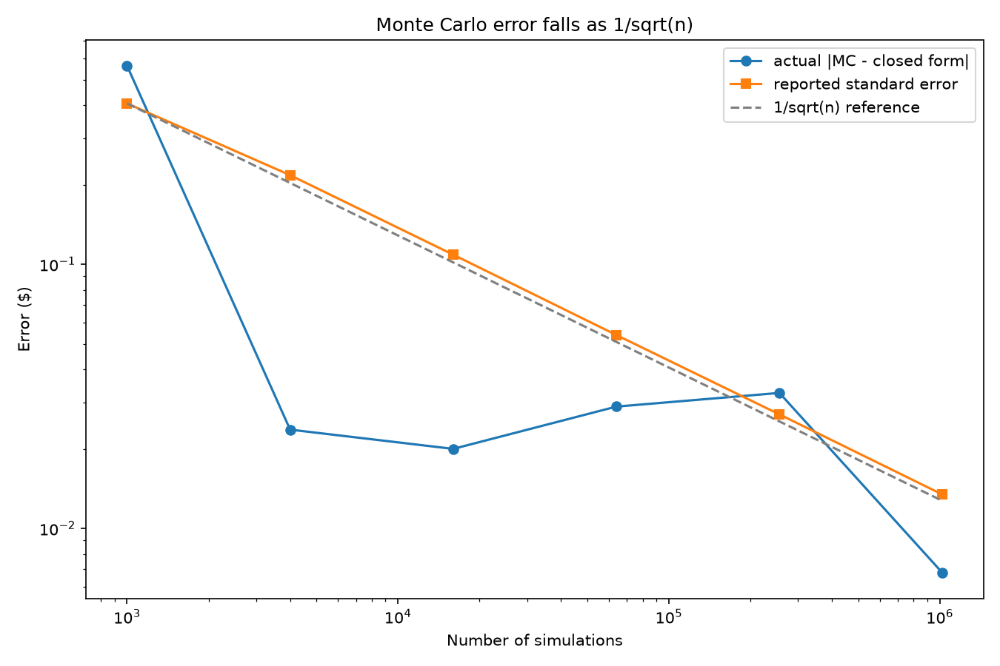
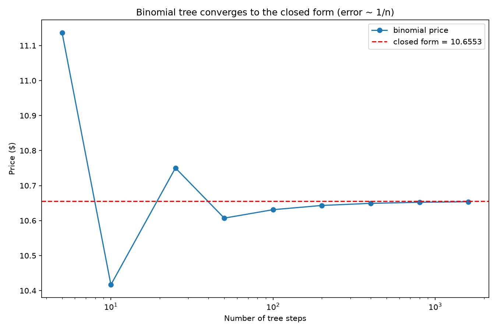
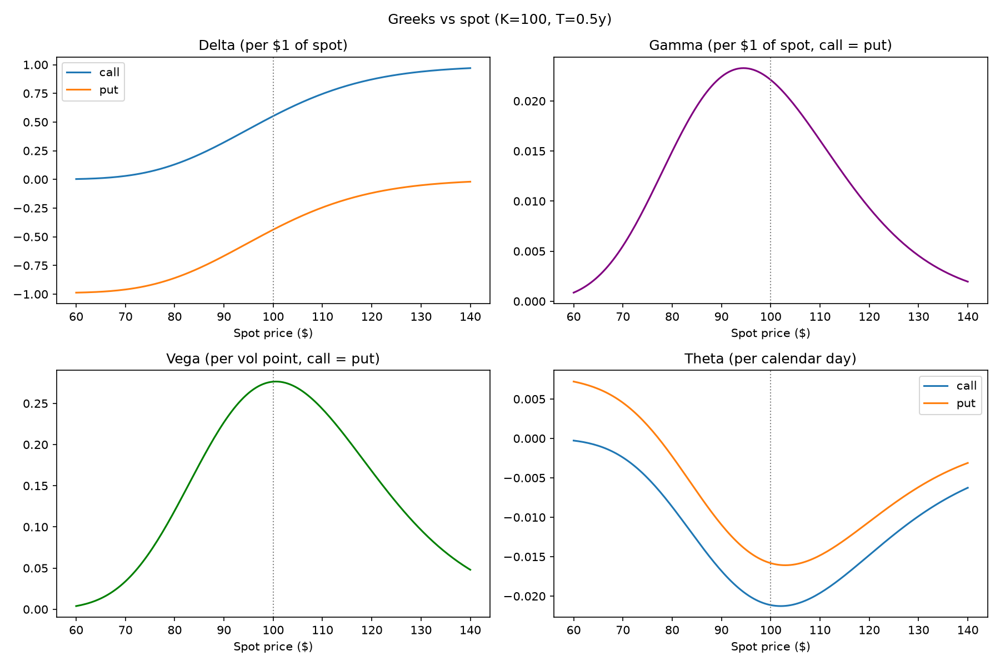
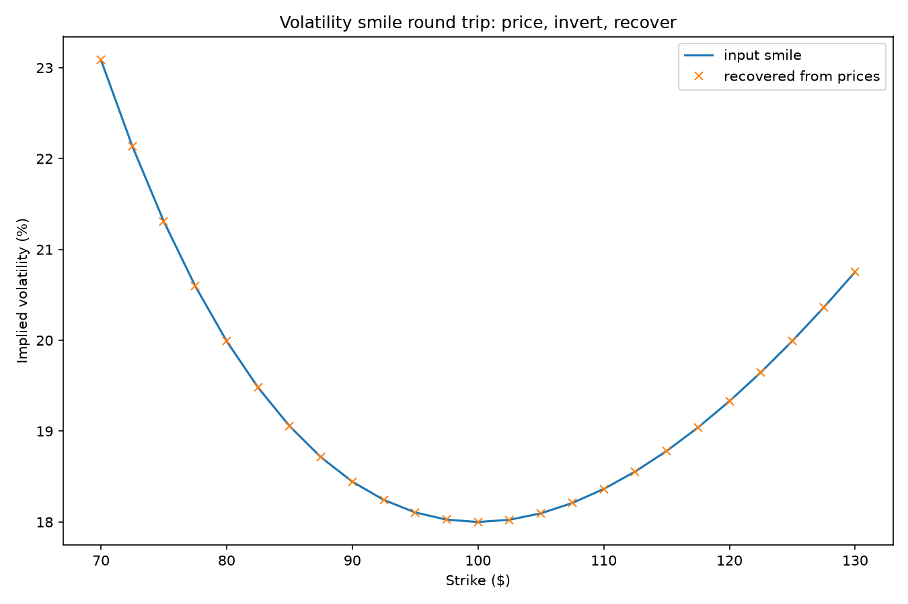

# Project 3: Independent Model Validation of Option Pricing

## The framing

This is not "I built a Black-Scholes pricer." It is an exercise in
**independent model validation**: the same European option is priced by
three unrelated algorithms — a closed-form formula, a Monte Carlo
engine, and a binomial lattice — and the work is in demonstrating that
they agree, at the expected accuracy, for the expected reasons.

That is what model validation teams actually do. A single
implementation can be wrong in ways that look plausible; three
independent routes to the same number, plus model-free identities that
hold regardless of the model (put-call parity, American exercise
bounds), leave a bug very few places to hide.

## The three implementations

**Closed form** ([src/black_scholes.py](src/black_scholes.py)) —
Black-Scholes-Merton with a continuous dividend yield q, and all seven
Greeks analytically: delta, gamma, vega, theta, rho, vanna, volga.
Greeks are returned in **market conventions**, stated in each
docstring: vega per volatility point (÷100), theta per calendar day
(÷365), rho per basis point (÷10,000). Getting units right is half of
Greek risk reporting; the raw calculus derivatives are what textbooks
print, not what desks quote.

**Monte Carlo** ([src/monte_carlo.py](src/monte_carlo.py)) —
risk-neutral simulation of the terminal price:
`S_T = S_0 · exp((r − q − σ²/2)T + σ√T·Z)`. The −σ²/2 term is the Ito
correction converting price drift into log-price drift; omitting it is
the classic MC pricing bug (prices biased high by ~half the variance).
Antithetic variates (pairing every Z with −Z) provide variance
reduction, and the standard error is computed over pair averages — the
correct unit of independence. Every price comes with a 95% confidence
interval, because a Monte Carlo number without an error bar is not a
price.

**Binomial tree** ([src/binomial_tree.py](src/binomial_tree.py)) —
Cox-Ross-Rubinstein lattice with backward induction, supporting both
European and **American** exercise: at each node the value is floored
at immediate exercise. American optionality is the tree's reason to
exist here — it is what the closed form cannot do.

**Implied volatility** ([src/implied_vol.py](src/implied_vol.py)) —
Brent's method inverts the price for σ. Because vega > 0 the price is
strictly monotone in σ, so the root is unique when it exists; quotes
outside the no-arbitrage price bounds raise a clear `ValueError`
(a stale or arbitrageable quote) rather than a numerical failure.

## Validation results

Reproduce with `python run_analysis.py`. Base scenario: S=100, r=4%,
q=2% (deliberately non-zero so the dividend code paths are exercised),
σ=25%; grid of 7 strikes (70–130) × 4 maturities (0.25–2y).

### Cross-method agreement: 56/56 checks passed

| Check | Result |
|-------|--------|
| Monte Carlo vs closed form (200k paths, within 3 standard errors) | 28/28 pass, worst deviation $0.112 |
| Binomial vs closed form (1,000 steps, tolerance $0.02) | 28/28 pass, worst deviation $0.0033 |
| Put-call parity across grid | worst error 2.1e-14 (machine precision) |
| Smile round trip (price → invert → recover σ) | worst vol error 7.1e-14 |
| American put vs European put (K=110, 1y) | premium +$0.468 > 0 ✓ |
| American call vs European call, q=0 | difference 0.0 ✓ |

### Convergence at the theoretically expected rates



Monte Carlo error is statistical: it falls as 1/√n — quadrupling the
scenarios halves the error — and the engine's *reported* standard error
tracks the reference line, meaning its error bars are honest, not just
its point estimates.



Binomial error is a discretisation bias, not noise: it shrinks roughly
as 1/n and *oscillates* as the strike moves between lattice nodes. The
sawtooth is a signature worth recognising when validating lattice
models — it is expected behaviour, not instability.

### Greeks: analytical vs finite differences

Central finite differences recompute every Greek without using the
analytical formulas. Worst absolute disagreement across all seven
Greeks, calls and puts: **1.7e-5** (on delta; all others below 1.3e-6).



The shapes are the standard sanity checks: call delta rises 0 → e^(−qT)
through the strike; gamma and vega peak near the money and are
identical for calls and puts; theta is most negative at the money,
where optionality decays fastest — and the deep in-the-money put theta
goes *positive* (the discounted strike pulls the price up toward
intrinsic value as expiry nears).

### Volatility smile round trip



A stylised smile (quadratic in log-moneyness) is fed through the
pricer, and implied volatilities are recovered from the resulting
prices. Recovered points sit on the input curve to 14 decimal places:
the pricer and the inverter are exactly consistent.

## Running it

```bash
pip install -r ../requirements.txt
pytest            # 7 tests
python run_analysis.py
```

## Tests

`tests/test_project3.py` pins the code to external anchors:

1. Black-Scholes matches Hull's textbook Example 15.6 (call 4.76, put
   0.81) — an authority independent of this codebase.
2. Put-call parity holds to 1e-10 across strikes and maturities.
3. The Monte Carlo price lands inside its own 95% confidence interval
   of the closed form.
4. The binomial tree converges to Black-Scholes as steps increase.
5. Analytical and finite-difference Greeks agree to 1e-4 in market
   units, for all seven Greeks, calls and puts.
6. Implied volatility round trip recovers the input σ to 1e-8, and a
   quote violating no-arbitrage bounds raises a clear error.
7. Gamma and vega are identical for calls and puts — verified by
   finite differences on the two prices separately (differentiating
   put-call parity twice), so the test does not simply call one shared
   formula twice.

## Limitations

- **Constant volatility, no smile modelling.** Black-Scholes assumes
  one σ for all strikes; real markets quote a smile/skew, which is why
  the implied vol solver exists. Pricing consistently *across* strikes
  needs a smile-aware model (local vol, stochastic vol) — here the
  smile is only reconstructed, not modelled.
- **European focus.** American exercise is handled only by the binomial
  tree, only for a single underlying, and without dividends beyond a
  continuous yield; discrete dividend dates materially change early
  exercise of calls.
- **No dividends beyond a continuous yield.** Real equity dividends are
  discrete cash amounts on known dates, not a smooth yield.
- **No transaction costs or discrete hedging.** The Greeks assume
  continuous, frictionless rehedging; real hedging is discrete and
  costly, so realised P&L differs from the model's promise
  (hedging-error variance is a project in itself).
- **Constant rates.** r is flat and non-stochastic; fine at these
  maturities, not for long-dated or rate-hybrid products.
